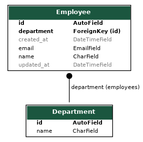
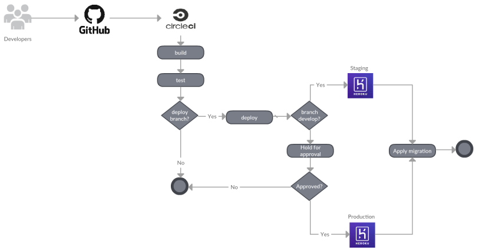
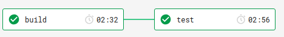
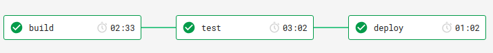
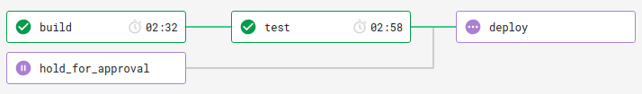

# Employee Manager

[](https://circleci.com/gh/brunobcardoso/employee-manager/tree/master)
[](https://coveralls.io/github/brunobcardoso/employee-manager?branch=master)
[](https://www.codefactor.io/repository/github/brunobcardoso/employee-manager)

A web application to manage employees' information, built with Django and Django REST framework.

## Dependencies
For local installation, this project requires Python3.7 and [Pipenv](https://pipenv.readthedocs.io/en/latest/) to be installed.
Otherwise, if you have `Docker` and `Docker Compose` installed, you can jump directly to installation.

## Installation

Clone the project and change directory
```console
$ git clone https://github.com/brunobcardoso/employee-manager
$ cd employee-manager
```

#### With Docker:
```console
$ make run
```

#### Locally:
```console
$ pip install pipenv
$ cp .env.example .env
$ pipenv install --dev --skip-lock
$ pipenv run python manage.py migrate
$ pipenv run manage.py runserver
```

The development server should be running at: http://localhost:8000/

## Running the tests

#### Tests:
```console
make test
```
or
```console
pipenv run pytest
```

#### Coverage:
```console
make coverage
```

## Employee Manager Admin Panel
Create a superuser to manage the system:
```console
make superuser
```

Access Admin panel at: [http://localhost:8000/admin/](http://localhost:8000/admin/)

## API Documentation

Swagger UI: [http://localhost:8000/swagger/](http://localhost:8000/swagger/)

ReDoc: [http://localhost:8000/redoc/](http://localhost:8000/redoc/)

Postman collection: [docs/EmployeeManager API v1.postman_collection.json](docs/EmployeeManager_API_v1.postman_collection.json)

## Entity Relationship Diagram(ERD)



## Deployment

The deployment process is automated by CircleCI whenever `master` or `develop` changes.

**Staging:** https://staging-employee-manager.herokuapp.com/

**Production:** https://production-employee-manager.herokuapp.com/

### Pipeline



---
**Examples:**

Workflow for a non-deploy-branch



Workflow for `develop` branch



Workflow for `master` branch

